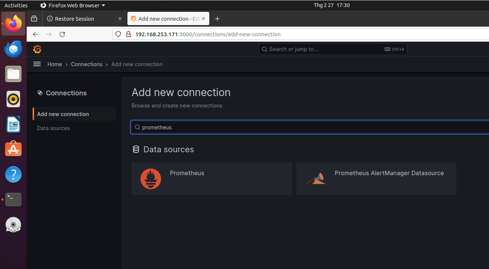
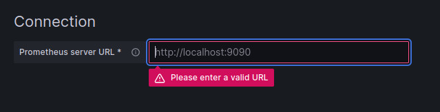
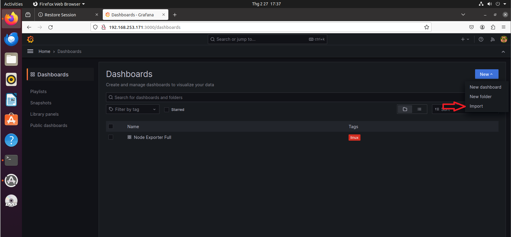
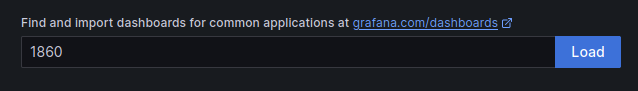
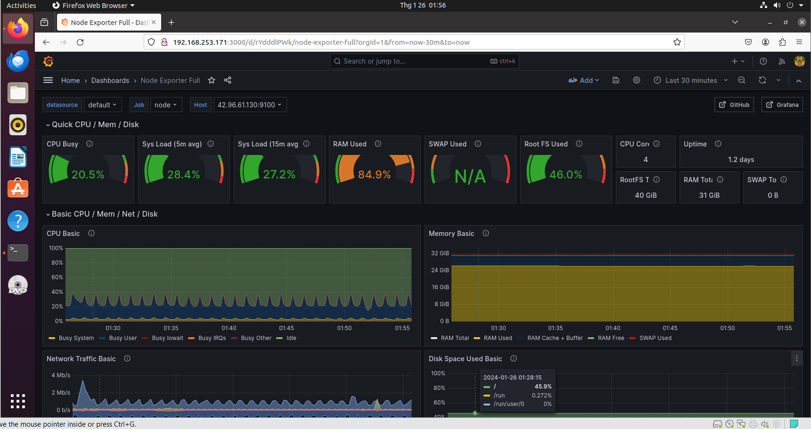

#How to install Prometheus, node_exporter in Centos 7.9 and Ubuntu 20.04, and install Grafana in Ubuntu 20.04
---
Node_exporter will take data about server performance (CPU, Ram, Network,...) and then export it to prometheus. Grafana is like a WebUI that visually displays prometheus data for easy analysis. In addition to prometheus, Grafana has Can link with many other monitoring tools.
For servers that need to be monitored, you only need to install node_exporter, but for servers used to monitor and display information of the remaining servers, you need to install grafana and prometheus. It is recommended to use a server using OS Ubuntu for monitoring. For instance, to monitor Multi CentOS servers, install node_exporter in all CentOS nodes, install prometheus and grafana in 1 Ubuntu node and then export data from all node_exporters to the prometheus in Ubuntu Node.

**1. Install prometheus Ubuntu20.04**
- Download and unzip file
```
# wget https://github.com/prometheus/prometheus/releases/download/v2.49.0-rc.1/prometheus-2.49.0-rc.1.linux-amd64.tar.gz
# tar xzf prometheus-2.49.0-rc.1.linux-amd64.tar.gz
```
- Install
```
# mv prometheus-2.49.0-rc.1.linux-amd64 /etc/prometheus
# vi /etc/systemd/system/prometheus.service
[Unit]
Description=Prometheus
Wants=network-online.target
After=network-online.target
[Service]
ExecStart=/etc/prometheus/prometheus --config.file=/etc/prometheus/prometheus.yml
Restart=always
[Install]
WantedBy=multi-user.target
```
- Start the service
```
# systemctl daemon-reload
# systemctl restart prometheus
# systemctl enable prometheus
# systemctl status prometheus
```
Can process to <ip_server_prometheus>:9090 to observe information of prometheus installed.
**2. Install node exporter in Ubuntu**
- Download and unzip rar file:
```
# wget https://github.com/prometheus/node_exporter/releases/download/v1.7.0/node_exporter-1.7.0.linux-amd64.tar.gz
# tar xzf node_exporter-1.7.0.linux-amd64.tar.gz
```
- Install:
```
# mv node_exporter-1.7.0.linux-amd64 /etc/node_exporter
# vi /etc/systemd/system/node_exporter.service
[Unit]
Description=Node Exporter
Wants=network-online.target
After=network-online.target
[Service]
ExecStart=/etc/node_exporter/node_exporter
Restart=always
[Install]
WantedBy=multi-user.target
```
- Start the service
```
#systemctl daemon-reload
#systemctl restart node_exporter
#systemctl enable node_exporter
#systemctl status node_exporter
```
Can process to <node_exporter_ip>:9100 to observe the system data extracted by the node.
**Extract system data from node_exporter to prometheus:**
Login on Prometheus server again
(Note that this file is used to receive data output from the node_exporter into prometheus. By default, it will monitor the server with prometheus installed)
```
# vi /etc/prometheus/prometheus.yml
global:
  scrape_interval: 15s

scrape_configs:
- job_name: node
  static_configs:
  - targets: ['node_exporter_ip:9100']

# systemctl restart prometheus
```
Process again to <ip_server_prometheus>:9090 to check the node being monitored by prometheus .
**3. Install Prometheus on centos7**
- Add Prometheus User
```
# useradd --no-create-home --shell /bin/false prometheus
```
- Create diectory and change ownership
```
mkdir /etc/prometheus
mkdir /var/lib/prometheus
chown prometheus:prometheus /etc/prometheus
chown prometheus:prometheus /var/lib/prometheus
```
- Download, extract Prometheus  file & rename it.
```
wget https://github.com/prometheus/prometheus/releases/download/v2.8.1/prometheus-2.8.1.linux-amd64.tar.gz
tar -xvzf prometheus-2.8.1.linux-amd64.tar.gz
mv prometheus-2.8.1.linux-amd64 prometheuspackage
```
- Copy “prometheus” and “promtool” binary and change ownership
```
cp prometheuspackage/prometheus /usr/local/bin/
cp prometheuspackage/promtool /usr/local/bin/
chown prometheus:prometheus /usr/local/bin/prometheus
chown prometheus:prometheus /usr/local/bin/promtool
```
- Copy “consoles” and “console_libraries”
```
cp -r prometheuspackage/consoles /etc/prometheus
cp -r prometheuspackage/console_libraries /etc/prometheus
chown -R prometheus:prometheus /etc/prometheus/consoles
chown -R prometheus:prometheus /etc/prometheus/console_libraries
```
- Configure Prometheus
```
# vi /etc/prometheus/prometheus.yml
global:
  scrape_interval: 10s

scrape_configs:
  - job_name: 'prometheus_master'
    scrape_interval: 5s
    static_configs:
      - targets: ['ip_server_prometheus:9090']
```
- Change the ownership
```
# chown prometheus:prometheus /etc/prometheus/prometheus.yml
# vi /etc/systemd/system/prometheus.service
[Unit]
Description=Prometheus
Wants=network-online.target
After=network-online.target
[Service]
User=prometheus
Group=prometheus
Type=simple
ExecStart=/usr/local/bin/prometheus \
--config.file /etc/prometheus/prometheus.yml \
--storage.tsdb.path /var/lib/prometheus/ \
--web.console.templates=/etc/prometheus/consoles \
--web.console.libraries=/etc/prometheus/console_libraries
[Install]
WantedBy=multi-user.target
```
- Start service
```
# systemctl daemon-reload
# systemctl start prometheus
# systemctl status prometheus
```

Process to <ip_server_prometheus>:9090 to check the node being monitored by prometheus .
**4. Install  Node Exporter Centos 7.9**
- Download and unzip file
```
wget https://github.com/prometheus/node_exporter/releases/download/v0.17.0/node_exporter-0.17.0.linux-amd64.tar.gz 
tar -xvzf node_exporter-0.17.0.linux-amd64.tar.gz
```
- Add nodeusr user
```
useradd -rs /bin/false nodeusr
mv node_exporter-0.17.0.linux-amd64/node_exporter /usr/local/bin/
```
- Change and edit the ownership
```
vi /etc/systemd/system/node_exporter.service
[Unit]
Description=Node Exporter
After=network.target
[Service]
User=nodeusr
Group=nodeusr
Type=simple
ExecStart=/usr/local/bin/node_exporter
[Install]
WantedBy=multi-user.target
```
- Start the service
```
systemctl daemon-reload
systemctl start node_exporter
systemctl enable node_exporter
```
Can process to <node_exporter_ip>:9100 to observe the system data extracted by the node_exporter.
**Extract system data from node_exporter to prometheus:**
Login on Prometheus server again
```
# vim /etc/prometheus/prometheus.yml
- job_name: 'node_exporter_centos'
    scrape_interval: 5s
    static_configs:
      - targets: ['node_exporter_ip:9100']

# systemctl restart prometheus
```
Process again to <ip_server_prometheus>:9090 to check the node being monitored by prometheus .
**5. Install grafana in Ubuntu**
```
# sudo apt-get install -y adduser libfontconfig1 musl
# wget https://dl.grafana.com/enterprise/release/grafana-enterprise_10.2.3_amd64.deb
# sudo dpkg -i grafana-enterprise_10.2.3_amd64.deb
# systemctl restart grafana-server
# systemctl enable grafana-server
# systemctl status grafana-server
```
Process to: <ip_server>:3000, login (user: admin, pass: admin)
Home -> Connection -> Find prometheus

-> Add new data source
Http URL: http://<ip_server_prometheus>:9090 -> Save&test

Home -> Dashboard -> New -> Import

Find and import dashboards for common applications at grafana.com/dashboards: 1860 -> Load

Select a Prometheus datasource -> Import
Grafana dashboard:



